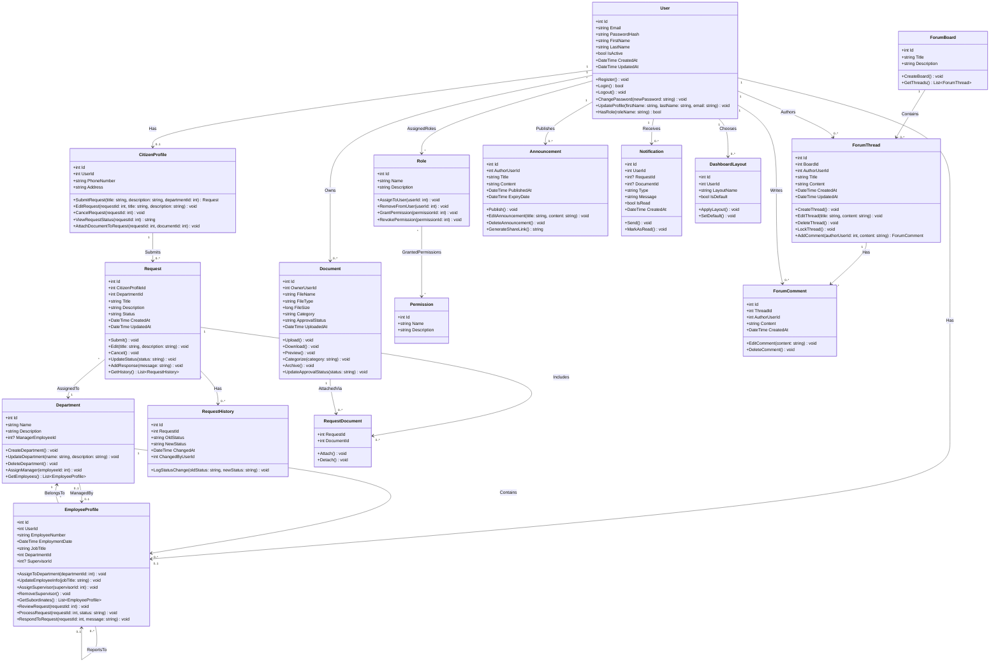

## Class diagram

```mermaid
classDiagram

class User {
    +int Id
    +string Email
    +string PasswordHash
    +string FirstName
    +string LastName
    +bool IsActive
    +DateTime CreatedAt
    +DateTime UpdatedAt
    +Register() void
    +Login() bool
    +Logout() void
    +ChangePassword(newPassword: string) void
    +UpdateProfile(firstName: string, lastName: string, email: string) void
    +HasRole(roleName: string) bool
}

class CitizenProfile {
    +int Id
    +int UserId
    +string PhoneNumber
    +string Address
    +SubmitRequest(title: string, description: string, departmentId: int) Request
    +EditRequest(requestId: int, title: string, description: string) void
    +CancelRequest(requestId: int) void
    +ViewRequestStatus(requestId: int) string
    +AttachDocumentToRequest(requestId: int, documentId: int) void
}

class EmployeeProfile {
    +int Id
    +int UserId
    +string EmployeeNumber
    +DateTime EmploymentDate
    +string JobTitle
    +int DepartmentId
    +int? SupervisorId
    +AssignToDepartment(departmentId: int) void
    +UpdateEmployeeInfo(jobTitle: string) void
    +AssignSupervisor(supervisorId: int) void
    +RemoveSupervisor() void
    +GetSubordinates() List~EmployeeProfile~
    +ReviewRequest(requestId: int) void
    +ProcessRequest(requestId: int, status: string) void
    +RespondToRequest(requestId: int, message: string) void
}

class Department {
    +int Id
    +string Name
    +string Description
    +int? ManagerEmployeeId
    +CreateDepartment() void
    +UpdateDepartment(name: string, description: string) void
    +DeleteDepartment() void
    +AssignManager(employeeId: int) void
    +GetEmployees() List~EmployeeProfile~
}

class Request {
    +int Id
    +int CitizenProfileId
    +int DepartmentId
    +string Title
    +string Description
    +string Status
    +DateTime CreatedAt
    +DateTime UpdatedAt
    +Submit() void
    +Edit(title: string, description: string) void
    +Cancel() void
    +UpdateStatus(status: string) void
    +AddResponse(message: string) void
    +GetHistory() List~RequestHistory~
}

class RequestHistory {
    +int Id
    +int RequestId
    +string OldStatus
    +string NewStatus
    +DateTime ChangedAt
    +int ChangedByUserId
    +LogStatusChange(oldStatus: string, newStatus: string) void
}

class Document {
    +int Id
    +int OwnerUserId
    +string FileName
    +string FileType
    +long FileSize
    +string Category
    +string ApprovalStatus
    +DateTime UploadedAt
    +Upload() void
    +Download() void
    +Preview() void
    +Categorize(category: string) void
    +Archive() void
    +UpdateApprovalStatus(status: string) void
}

class RequestDocument {
    +int RequestId
    +int DocumentId
    +Attach() void
    +Detach() void
}

class Role {
    +int Id
    +string Name
    +string Description
    +AssignToUser(userId: int) void
    +RemoveFromUser(userId: int) void
    +GrantPermission(permissionId: int) void
    +RevokePermission(permissionId: int) void
}

class Permission {
    +int Id
    +string Name
    +string Description
}

class ForumBoard {
    +int Id
    +string Title
    +string Description
    +CreateBoard() void
    +GetThreads() List~ForumThread~
}

class ForumThread {
    +int Id
    +int BoardId
    +int AuthorUserId
    +string Title
    +string Content
    +DateTime CreatedAt
    +DateTime UpdatedAt
    +CreateThread() void
    +EditThread(title: string, content: string) void
    +DeleteThread() void
    +LockThread() void
    +AddComment(authorUserId: int, content: string) ForumComment
}

class ForumComment {
    +int Id
    +int ThreadId
    +int AuthorUserId
    +string Content
    +DateTime CreatedAt
    +EditComment(content: string) void
    +DeleteComment() void
}

class Announcement {
    +int Id
    +int AuthorUserId
    +string Title
    +string Content
    +DateTime PublishedAt
    +DateTime ExpiryDate
    +Publish() void
    +EditAnnouncement(title: string, content: string) void
    +DeleteAnnouncement() void
    +GenerateShareLink() string
}

class Notification {
    +int Id
    +int UserId
    +int? RequestId
    +int? DocumentId
    +string Type
    +string Message
    +bool IsRead
    +DateTime CreatedAt
    +Send() void
    +MarkAsRead() void
}

class DashboardLayout {
    +int Id
    +int UserId
    +string LayoutName
    +bool IsDefault
    +ApplyLayout() void
    +SetDefault() void
}

User "1" --> "0..1" CitizenProfile : Has
User "1" --> "0..1" EmployeeProfile : Has

EmployeeProfile "*" --> "1" Department : BelongsTo
Department "1" --> "0..*" EmployeeProfile : Contains
Department "0..1" --> "0..1" EmployeeProfile : ManagedBy
EmployeeProfile "0..*" --> "0..1" EmployeeProfile : ReportsTo

CitizenProfile "1" --> "0..*" Request : Submits
Request "*" --> "1" Department : AssignedTo
Request "1" --> "0..*" RequestHistory : Has
Request "1" --> "0..*" RequestDocument : Includes
Document "1" --> "0..*" RequestDocument : AttachedVia

User "1" --> "0..*" Document : Owns
User "1" --> "0..*" Notification : Receives

User "*" --> "*" Role : AssignedRoles
Role "*" --> "*" Permission : GrantedPermissions

ForumBoard "1" --> "0..*" ForumThread : Contains
ForumThread "1" --> "0..*" ForumComment : Has
User "1" --> "0..*" ForumThread : Authors
User "1" --> "0..*" ForumComment : Writes

User "1" --> "0..*" Announcement : Publishes
User "1" --> "0..*" DashboardLayout : Chooses
```